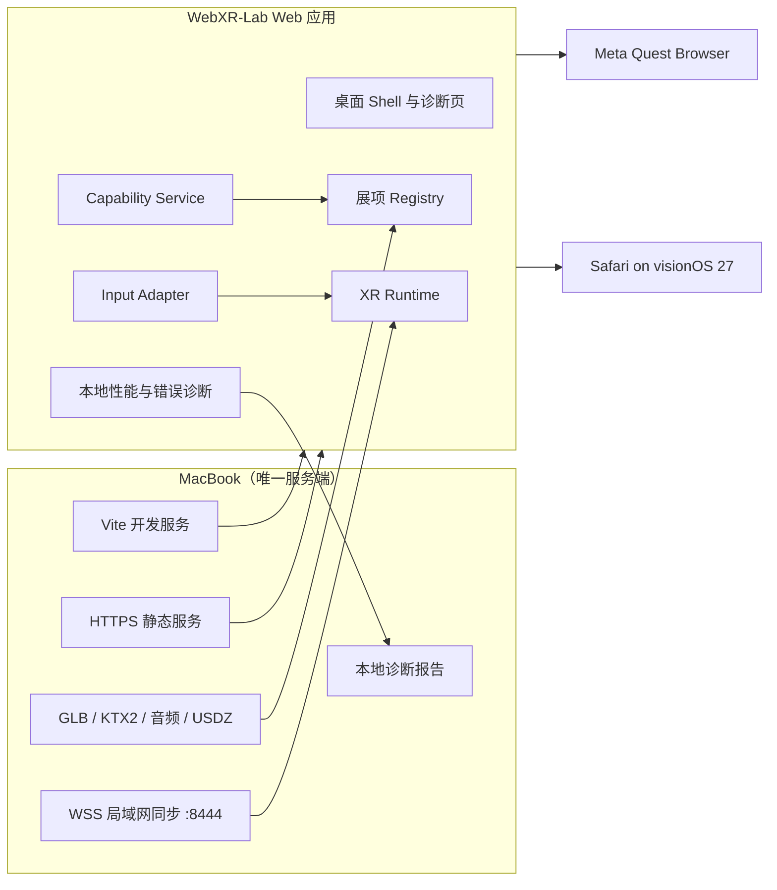

# 技术架构

## 技术栈

首版采用：

- TypeScript + Vite
- Three.js，WebGL2 作为共同渲染基线
- 原生 WebXR API + 项目自有 Input Adapter
- Web Audio API / Three.js positional audio
- 固定预算轻量刚体；需要更复杂约束时再评估 Rapier WASM
- Vitest + Playwright + Meta IWER 桌面模拟
- MacBook 上的 Vite HTTPS preview、报告接收与 `ws` WSS 房间
- pnpm 管理依赖

选择 Three.js 而不在首版引入 React 渲染层，是为了直接控制 `XRSession`、动态 `XRInputSource`、帧循环和资源生命周期。所有引擎相关代码集中在适配层，展项不得直接依赖设备名称。

## 系统视图



## 目录蓝图

```text
WebXR-Lab/
├── src/
│   ├── app/                 # 桌面 Shell、路由、启动入口
│   ├── xr/
│   │   ├── session/         # 会话建立、引用空间、退出与恢复
│   │   ├── capabilities/    # 模式与可选特性探测
│   │   ├── input/           # 手、控制器、transient pointer、桌面输入
│   │   ├── interaction/     # hover/select/grab/manipulate 语义
│   │   └── diagnostics/     # 帧时、错误、设备报告
│   ├── hub/                 # Hub 场景与门户
│   ├── experiences/         # 每个展项一个独立目录
│   ├── graphics/            # 材质、后处理、粒子、资源加载
│   ├── collaboration/       # WSS 客户端、协议与离线降级
│   └── shared/              # 数学、事件、通用组件
├── public/
│   └── assets/
│       ├── common/          # GLB/KTX2/音频
│       └── visionos/        # USDZ/HDR/空间网页资源
├── scripts/                 # 证书、HTTPS/WSS 服务、地址与资源检查
└── docs/
```

## 展项协议

每个展项必须导出一份 manifest 和统一生命周期：

```ts
interface ExperienceManifest {
  id: string;
  title: string;
  kind: "shared" | "quest-enhanced" | "visionos-enhanced";
  required: Capability[];
  optional: Capability[];
  comfort: "stationary" | "room-scale" | "locomotion";
  assetBudgetMB: number;
  preload: "hub" | "on-demand";
}

interface Experience {
  mount(context: ExperienceContext): Promise<void>;
  enter(): Promise<void>;
  update(frame: XRFrame | null, deltaSeconds: number): void;
  pause(): void;
  resume(): void;
  exit(): Promise<void>;
  dispose(): void;
}
```

Registry 依据能力报告过滤门户。展项退出后必须释放 GPU 资源、音频节点、事件监听器、物理世界和网络订阅。

## 能力系统

能力判断分三层：

1. **静态存在性：** `navigator.xr`、API 类型和 HTML `<model>` / Immersive API 是否存在。
2. **模式支持：** `isSessionSupported("immersive-vr" | "immersive-ar")`。
3. **会话实测：** 在用户点击后请求可选特性，记录实际得到的引用空间、输入源、手关节、layers、hit-test 等行为。

不使用 User-Agent 决定功能；UA 仅写入诊断报告，帮助复现问题。

## 输入语义

底层输入源会变化，业务层只接收稳定动作：

| 业务动作 | Vision Pro | Quest 手部 | Quest 控制器 | 桌面 |
|----------|------------|------------|--------------|------|
| aim | transient pointer 的 `targetRaySpace` | 手部射线 | controller target ray | 鼠标射线 |
| select | pinch 的 select 事件 | pinch/select | trigger | click |
| direct-touch | 手关节近场命中 | 手关节近场命中 | 近场碰撞（可选） | 不支持 |
| grab | pinch + `gripSpace` / 关节判断 | pinch / 关节判断 | squeeze | drag |
| manipulate | 双手关节关系 | 双手关节关系 | 双控制器 | 多点/修饰键 |
| menu | 统一腕部/空间按钮 | 统一腕部/空间按钮 | menu 映射 | Escape |

Input Adapter 必须处理：

- `inputsourceschange` 的动态增删；
- transient pointer 只在捏合期间存在；
- persistent hand inputs 不产生选择事件；
- 手部追踪短暂丢失和重新出现；
- Quest 手与控制器的运行时切换；
- handedness 缺失、未知 profile 和没有 `gripSpace` 的输入。

## 渲染与资源预算

共同展项以 Quest 为最低性能基线：

- 目标：持续 72 FPS，单帧预算约 13.9 ms。
- 单展项建议可见 draw calls ≤ 120，可见三角形 ≤ 250k。
- 首屏 Shell + Hub 关键资源压缩后 ≤ 15 MB。
- 单展项按需资源建议 ≤ 25 MB；大资源必须明确预加载进度。
- 单张纹理默认不超过 2048²；使用 KTX2/Basis，模型使用 GLB + Meshopt。
- 禁止在每帧循环创建大量临时对象；禁止同步解码大型资源。
- 后处理、实时阴影、透明层和粒子数量按运行时质量档降级。
- USDZ 是 visionOS 空间网页增强资源，不替代共同层的 GLB。

这些数字是首轮预算，不是永远固定；真机报告将记录 p50/p95 帧时间、掉帧和资源峰值，并据此调整。

## 本地服务与 HTTPS

### 地址
- 首选：`https://<Mac-LocalHostName>.local:8443`
- 备用：`https://<Mac-LAN-IP>:8443`
- 启动脚本显示两个地址和二维码。

### 证书
- 使用 `mkcert` 创建仅供开发使用的本地 CA 和包含 `.local` 主机名、局域网 IP、`localhost` 的服务器证书。
- 服务器证书与私钥放在被 Git 忽略的本地目录。
- 只向头显安装 `rootCA.pem`；`rootCA-key.pem` 绝不复制、提交或共享。
- Vision Pro 的证书安装与完全信任步骤写入设备测试手册。
- Quest 的根证书信任方式必须在阶段 3 真机验证；若系统版本阻止用户 CA，备选方案是使用用户已有域名的公信证书 + 局域网解析，仍由 Mac 本地提供服务。

### 服务范围
- 默认仅绑定局域网接口，不做路由器端口转发。
- 生产演示运行静态文件与 WSS；无数据库和用户账户。
- 诊断报告默认保存在 Mac 本地，不发送第三方。
- 单机展项在首次缓存后不依赖互联网；协作展项要求 Mac 服务在线。

## 状态同步

局域网共创采用 Mac 上的 WSS：

- 服务端只做房间、时钟与权威状态转发。
- 交互对象同步“意图和低频权威状态”，不逐帧广播完整场景。
- 位置/旋转在客户端插值；冲突通过对象所有权租约处理。
- 离线或服务断开时，展项自动退化为单机模式。

## 质量策略

- TypeScript 开启严格模式。
- 核心数学、输入状态机和能力过滤写单元测试。
- Shell 和诊断页用 Playwright 测试。
- IWER 模拟常见 Quest 输入与会话，但所有“支持”结论必须由真机签字。
- 每个展项有资源预算检查、退出后资源泄漏检查和 10 分钟稳定性测试。
- 生产版本显示构建号，设备报告包含 OS/浏览器版本、会话模式、已获特性和错误日志。
